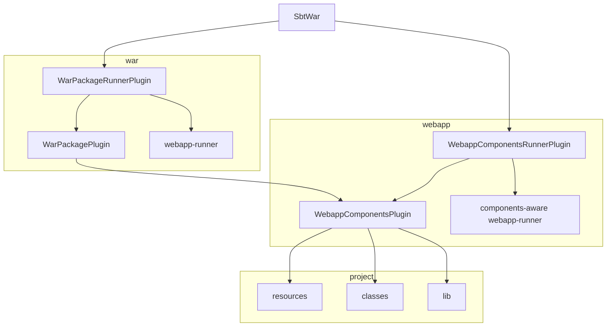

# Contributing

## Architecture




## Testing

```
$ sbt test scripted
```

## Publishing

sbt-war uses the process outlined in the [Using
Sonatype](https://www.scala-sbt.org/release/docs/Using-Sonatype.html)
section of the sbt manual for publishing to Maven Central via Sonatype.

Create a staging release in Sonatype:

```
$ export OLD_VERSION=5.0.0-M6
$ export NEW_VERSION=5.0.0-M7
$ nix-shell
$ sbt
> set ThisBuild / version := sys.env("NEW_VERSION")
> +publishSigned
> sonatypeBundleRelease
```

Wait for it to be synced to Maven Central:

* <https://repo1.maven.org/maven2/com/earldouglas/sbt-war_2.12_1.0/>

Update the documentation:

```
$ git checkout -b v$NEW_VERSION
$ sed -i "s/$OLD_VERSION/$NEW_VERSION/g" README.md
$ git add README.md
$ git commit -m "sbt-war: $OLD_VERSION -> $NEW_VERSION"
$ git push origin v$NEW_VERSION
```

Create and merge a pull request.

Tag the release:

```
$ git checkout main
$ git pull
$ git tag $NEW_VERSION -m "Version $NEW_VERSION"
$ git push --tags origin
```

Update the [Giter8 template](https://github.com/earldouglas/sbt-war.g8)
to use the new version.
