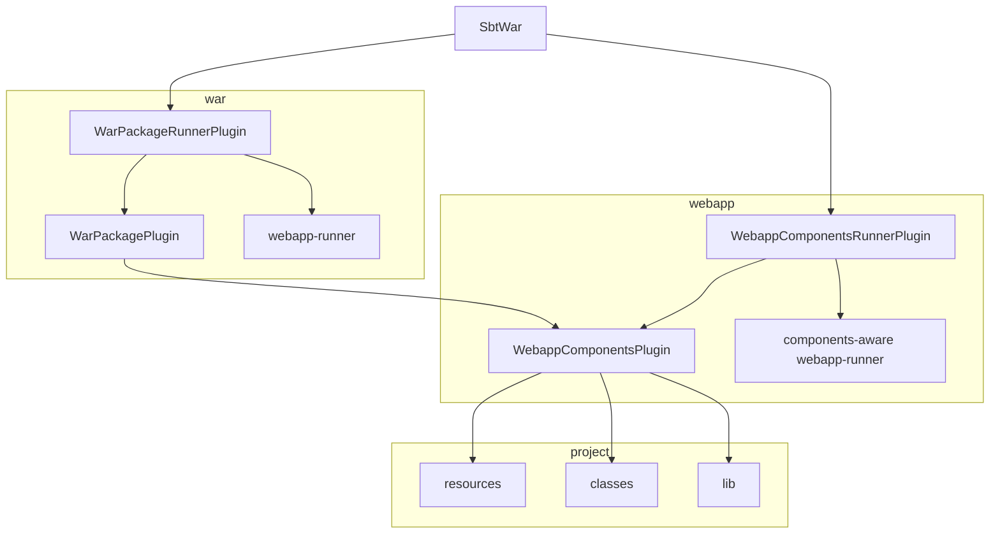

# Contributing

## Architecture




## Testing

```
$ sbt test scripted
```

## Publishing

sbt-war uses the process outlined in the [Using
Sonatype](https://www.scala-sbt.org/release/docs/Using-Sonatype.html)
section of the sbt manual for publishing to Maven Central via Sonatype.

Create a staging release in Sonatype:

```
$ nix-shell
$ sbt
> set version := "4.2.5"
> +publishSigned
```

Review it:

* Go to [Staging
  Repositories](https://oss.sonatype.org/#stagingRepositories) on Nexus
  Repository Manager
* Review the contents of the staging repository


Release it:

* Close the staging repository
* Release the staging repository to promote to Maven Central

Wait for it to be synced to Maven Central:

* <https://repo1.maven.org/maven2/com/earldouglas/sbt-war_2.12_1.0/>

Update the documentation:

```
$ git checkout -b v4.2.5
$ sed -i 's/4\.2\.2/4.2.5/g' README.md
$ git add README.md
$ git commit -m "Update version to 4.2.5"
$ git push origin v4.2.5
```

Tag the release:

```
$ git tag 4.2.5
$ git push --tags origin
```

Update the [Giter8 template](https://github.com/earldouglas/sbt-war.g8)
to use the new version.
