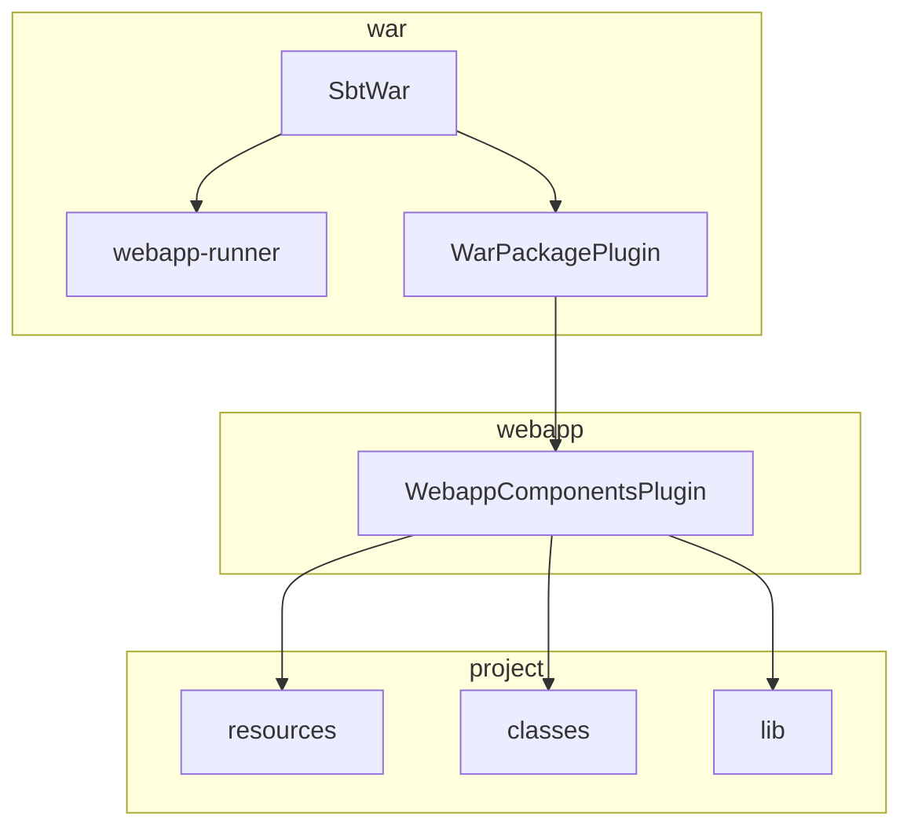

# Contributing

## Architecture


```mermaid
flowchart TB

    webappRunner[webapp-runner]

    subgraph war
      SbtWar
      WarPackagePlugin
      webappRunner
    end

    subgraph webapp
      WebappComponentsPlugin
    end

    subgraph project
        resources
        classes
        lib
    end


    WebappComponentsPlugin-->resources
    WebappComponentsPlugin-->classes
    WebappComponentsPlugin-->lib

    WarPackagePlugin-->WebappComponentsPlugin

    SbtWar-->WarPackagePlugin
    SbtWar-->webappRunner

```


## Testing

```
$ sbt test scripted
```

## Publishing

sbt-war uses the process outlined in the [Publishing to the Central
Repo](https://www.scala-sbt.org/2.x/docs/en/recipes/central.html)
section of the sbt manual for publishing to Maven Central via Sonatype.

Start the development environment:

```
$ devenv shell
```

Set up Sonatype credentials:

```
$ export SONATYPE_USERNAME=...
$ export SONATYPE_PASSWORD=...
```

Set the old and new versions:

```
$ export OLD_VERSION=5.1.2
$ export NEW_VERSION=5.2.0
```

Update the documentation:

```
$ git checkout -b v$NEW_VERSION
$ sed -i "s/$OLD_VERSION/$NEW_VERSION/g" README.md
$ git add README.md
$ git commit -m "sbt-war: $OLD_VERSION -> $NEW_VERSION"
$ git push origin v$NEW_VERSION
```

Create a release in Sonatype:

```
$ sbt
> set ThisBuild / version := sys.env("NEW_VERSION")
> +publishSigned
> sonaUpload
> sonaRelease
```

Wait for it to be synced to Maven Central:

* <https://repo1.maven.org/maven2/com/earldouglas/sbt-war_2.12_1.0/>
* <https://repo1.maven.org/maven2/com/earldouglas/sbt-war_sbt2_3/>

Merge the branch into `main`.

Create a tag:

```
$ git checkout main
$ git pull
$ git tag $NEW_VERSION -m "Version $NEW_VERSION"
$ git push --tags origin
```
